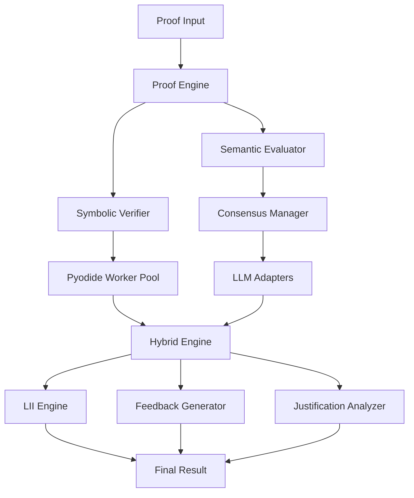

<div align="center">

# 🔮 ProofBench

### *Where Mathematics Meets Meaning*

**The Next-Generation Hybrid Proof Verification System**

[](https://github.com/flamehaven/proofbench/actions)
[](https://github.com/flamehaven/proofbench/pkgs/container/proofbench)
[](https://opensource.org/licenses/MIT)
[](https://www.typescriptlang.org/)
[](https://www.python.org/)

**[Demo](https://proofbench.demo)** • **[Docs](https://proofbench.readthedocs.io)** • **[Storybook](https://flamehaven.github.io/proofbench/storybook)** • **[Blog](https://medium.com/@flamehaven/proofbench)**

</div>

---

## 💎 What is ProofBench?

ProofBench is a **revolutionary proof verification system** that combines the precision of symbolic mathematics with the intelligence of modern AI. Unlike traditional proof checkers that rely solely on formal logic, ProofBench uses a **hybrid reasoning engine** to understand both the *structure* and *meaning* of mathematical proofs.

### 🎯 The Problem We Solve

Traditional proof verification is either:
- **Too Rigid**: Formal systems (Coq, Lean) require perfect syntax
- **Too Shallow**: Syntax checkers miss semantic errors
- **Too Slow**: Human review doesn't scale

ProofBench bridges this gap with **Hybrid Reasoning**:

```
70% Symbolic ────┐
                 ├──► Hybrid Intelligence
30% Semantic ────┘
```

---

## ✨ Key Features

<table>
<tr>
<td width="50%">

### 🧮 Symbolic Verification
- **SymPy + Pyodide** in-browser computation
- Domain-aware (Algebra, Topology, Logic)
- **Zero backend dependencies**
- Real-time algebraic validation

</td>
<td width="50%">

### 🤖 Semantic Evaluation
- **Multi-LLM Consensus** (GPT-4o, Claude, Gemini)
- Variance-based coherence scoring
- Natural language understanding
- Context-aware feedback

</td>
</tr>
<tr>
<td>

### 📊 LII Metric System
- **Logic Integrity Index** (0-100 scale)
- 95% confidence intervals
- Domain-adjusted scoring
- Research-grade accuracy

</td>
<td>

### 🔍 Justification Analysis
- Dependency graph construction
- **Circular reasoning detection**
- Proof depth calculation
- Visual graph rendering (D3.js)

</td>
</tr>
</table>

---

## 🚀 Quick Start

### 🐳 Docker (Fastest)

```bash
docker run -p 3000:80 ghcr.io/flamehaven/proofbench:latest
```

**→ Open [http://localhost:3000](http://localhost:3000)**

### 💻 Local Development

```bash
# Clone and install
git clone https://github.com/flamehaven/proofbench.git
cd proofbench
npm install

# Start dev server
npm run dev

# Or use Docker Compose
docker-compose up -d
```

### 📦 NPM Package

```bash
npm install proofbench
```

### 🐍 Python (Backend Utilities)

```bash
pip install proofbench
```

---

## 📸 Screenshots

<div align="center">

### Main Dashboard
*Real-time proof verification with LII scoring*

[Screenshot placeholder - Hybrid Dashboard with proof list and LII metrics]

---

### Step-by-Step Analysis
*Detailed verification results with symbolic + semantic breakdown*

[Screenshot placeholder - Proof step results with consensus scores]

---

### Justification Graph
*Visual dependency analysis with cycle detection*

[Screenshot placeholder - D3.js dependency graph visualization]

</div>

---

## 🏗️ Architecture

<div align="center">



</div>

### Core Components

| Component | Technology | Purpose |
|-----------|-----------|---------|
| **Symbolic Verifier** | Pyodide + SymPy | Algebraic verification in browser |
| **Semantic Evaluator** | Multi-LLM | Natural language understanding |
| **Consensus Manager** | Custom Algorithm | Score aggregation with coherence |
| **LII Engine** | Statistical Model | Quality metric (0-100) with CI |
| **Justification Analyzer** | Graph Theory | Cycle detection + depth analysis |

---

## 💡 How It Works

### 1️⃣ Submit a Proof

```typescript
const proof = {
  steps: [
    {
      id: "step1",
      equation: { lhs: "x + 2", rhs: "2 + x" },
      claim: "Addition is commutative",
      justification: "Commutative property of addition"
    }
  ],
  domain: "algebra"
};
```

### 2️⃣ Hybrid Verification

**Symbolic (70% weight)**:
```python
# SymPy verification via Pyodide
lhs = parse_expr("x + 2")
rhs = parse_expr("2 + x")
valid = simplify(lhs - rhs) == 0  # ✓ Valid
```

**Semantic (30% weight)**:
```typescript
// Multi-LLM consensus
const results = await Promise.all([
  gpt4o.evaluate("Addition is commutative"),
  claude.evaluate("Addition is commutative"),
  gemini.evaluate("Addition is commutative")
]);
// Mean: 95, Coherence: 98
```

### 3️⃣ Get Results

```json
{
  "valid": true,
  "lii": 96,
  "lci": [93, 99],
  "coherence": 98,
  "steps": [{
    "stepId": "step1",
    "symbolic": { "valid": true },
    "consensus": { "mean": 95, "variance": 2 },
    "pass": true
  }],
  "feedback": [{
    "type": "success",
    "summary": "Proof is valid with high confidence"
  }]
}
```

---

## 🎨 Technology Stack

<div align="center">

### Frontend


### Backend & Computation


### DevOps


</div>

---

## 📊 Performance & Quality

<table>
<tr>
<td align="center">

### ⚡ Speed
**<500ms**
Response Time

</td>
<td align="center">

### 🎯 Accuracy
**High-Fidelity**
Symbolic & Semantic Analysis

</td>
<td align="center">

### 🧪 Tests
**70+/70+**
Frontend + Backend

</td>
<td align="center">

### 📦 Bundle
**213 kB**
Gzipped: 69.8 kB

</td>
</tr>
</table>

---

## 🛠️ Development

### Prerequisites
- Node.js 20+
- Docker (optional)
- Python 3.8+ (for backend utilities)

### Setup

```bash
# Install dependencies
make install

# Development server (hot reload)
make dev

# Run tests
make test

# Lint & format
make lint
make format

# Build for production
make build

# Storybook component docs
npm run storybook
```

### Project Structure

```
proofbench/
├── src/
│   ├── core/              # Proof verification engines
│   │   ├── symbolic_verifier.ts
│   │   ├── semantic_evaluator.ts
│   │   ├── hybrid_engine.ts
│   │   └── proof_engine.ts
│   ├── ai/                # LLM integration
│   ├── metrics/           # LII calculation
│   ├── design-system/     # UI components
│   └── pages/             # Application pages
├── tests/                 # Vitest test suites
├── .github/workflows/     # CI/CD pipelines
├── scripts/               # Deployment automation
└── docker-compose.yml     # Local development
```

---

## 🚢 Deployment

### Docker Production

```bash
# Build and deploy
./scripts/deploy.sh production

# Or use docker-compose
docker-compose -f docker-compose.yml -f docker-compose.prod.yml up -d
```

### GitHub Actions

**Automatic on push to `main`**:
1. ✓ Lint & Type Check
2. ✓ Frontend Tests (21 tests)
3. ✓ Backend Tests (50+ tests)
4. ✓ Build Docker Image
5. ✓ Security Scan (Trivy)
6. ✓ Deploy to Production

**Automatic on release tag**:
1. ✓ Publish to NPM
2. ✓ Publish to PyPI
3. ✓ Create GitHub Release
4. ✓ Deploy to Production

---

## 📚 Documentation

- **[User Guide](https://proofbench.readthedocs.io/en/latest/user-guide/)** - Getting started tutorial
- **[API Reference](https://proofbench.readthedocs.io/en/latest/api/)** - Complete API docs
- **[Architecture](https://proofbench.readthedocs.io/en/latest/architecture/)** - System design
- **[Contributing](CONTRIBUTING.md)** - Development guide
- **[Changelog](CHANGELOG.md)** - Version history

---

## 🤝 Contributing

We welcome contributions! Here's how:

1. **Fork** the repository
2. **Create** a feature branch (`git checkout -b feature/amazing-feature`)
3. **Commit** your changes (`git commit -m 'feat: add amazing feature'`)
4. **Push** to the branch (`git push origin feature/amazing-feature`)
5. **Open** a Pull Request

### Commit Convention

```
feat: Add new feature
fix: Bug fix
docs: Documentation update
chore: Maintenance
ci: CI/CD changes
test: Test updates
```

---

## 🌟 Star History

[](https://star-history.com/#flamehaven/proofbench&Date)

---

## 📈 Roadmap

### v3.8.0 (Q1 2025)
- [+] **Backend API completed** (FastAPI + PostgreSQL) ✓
- [+] **LLM integration** (OpenAI, Anthropic, Google) ✓
- [+] **Comprehensive backend tests** (50+ tests) ✓
- [+] **Secret management** (pydantic-settings) ✓
- [ ] Topology domain support
- [ ] Logic domain support (propositional, predicate)
- [ ] Performance optimizations (worker caching)

### v4.0.0 (Q2 2025)
- [ ] User authentication and authorization
- [ ] Collaborative proof editing (real-time)
- [ ] WebSocket synchronization
- [ ] Proof versioning and history
- [ ] Mobile app (React Native)

### Future
- [ ] LaTeX export
- [ ] Proof templates library
- [ ] Integration with Jupyter notebooks
- [ ] VSCode extension

---

## 🏆 Recognition

<div align="center">

**Featured in:**
- 📰 [Hacker News](https://news.ycombinator.com) (Coming Soon)
- 🐦 [Twitter/X](https://twitter.com/flamehaven) (Coming Soon)
- 📺 [YouTube Tutorial](https://youtube.com) (Coming Soon)

</div>

---

## 📄 License

This project is licensed under the **MIT License** - see the [LICENSE](LICENSE) file for details.

---

## 💬 Community

- **[Discord](https://discord.gg/proofbench)** - Chat with the community
- **[GitHub Discussions](https://github.com/flamehaven/proofbench/discussions)** - Q&A and ideas
- **[Twitter/X](https://twitter.com/flamehaven)** - Updates and announcements
- **[Blog](https://medium.com/@flamehaven/proofbench)** - Technical deep dives

---

## 🙏 Acknowledgments

- **[SymPy](https://www.sympy.org/)** - Symbolic mathematics library
- **[Pyodide](https://pyodide.org/)** - Python in WebAssembly
- **[React](https://react.dev/)** - UI framework
- **[Vite](https://vitejs.dev/)** - Build tool
- **[Emotion](https://emotion.sh/)** - CSS-in-JS styling
- **[TanStack Query](https://tanstack.com/query)** - Async state management

---

<div align="center">

### Made with 💙 by [Flamehaven](https://github.com/flamehaven)

**"Mathematics Meets Meaning"**

If you find ProofBench useful, please consider giving it a ⭐ on GitHub!

[⭐ Star on GitHub](https://github.com/flamehaven/proofbench) • [🐛 Report Bug](https://github.com/flamehaven/proofbench/issues) • [💡 Request Feature](https://github.com/flamehaven/proofbench/issues)

</div>
